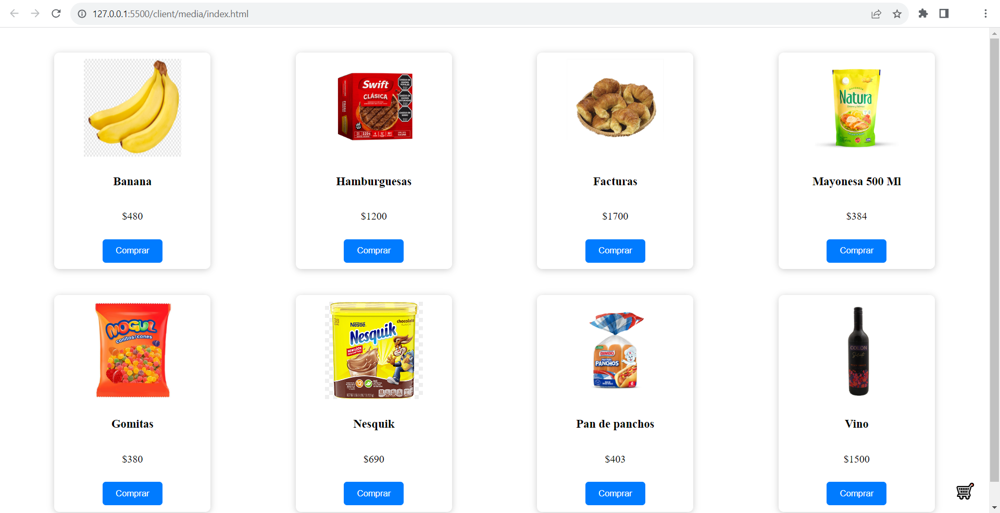
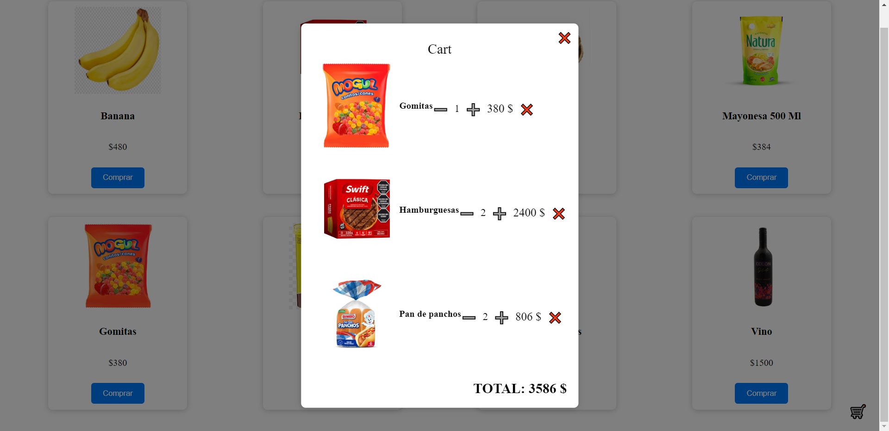
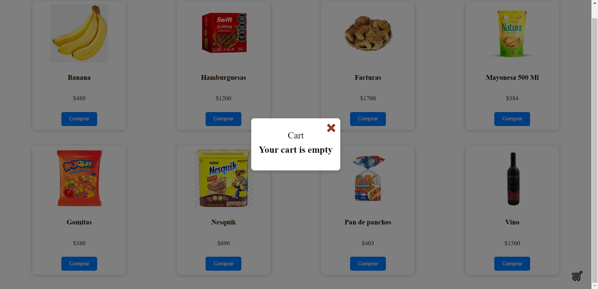

# Proyecto de E-Commerce en JavaScript

Este es un proyecto de E-Commerce desarrollado en el cuarto semestre del programa de Tecnología en Programación de la Universidad Tecnológica Nacional (Facultad Regional de San Rafael, Mendoza).

## Descripción del Proyecto

En este proyecto, hemos creado una tienda en línea que permite a los usuarios explorar una variedad de productos, agregar productos a su carrito de compras y realizar compras simuladas. El proyecto se centra en las siguientes áreas clave:

## Tecnologías Utilizadas

- HTML5
- CSS3
- JavaScript

## Funcionalidades Destacadas

- **Grid de Productos**: Los usuarios ven un grid con los productos disponibles

- **Agregar al Carrito**: Los usuarios pueden agregar N cantidad de productos al carrito de compras 

- **Eliminar del Carrito**: Los usuarios pueden eliminar productos del carrito de compras

- **Cálculo del Total**: El carrito calcula automáticamente el precio total de la compra en función de los productos seleccionados

## Capturas de Pantalla

**Página de Inicio:**

**Página de Productos:**

**Carrito de Compras:**

